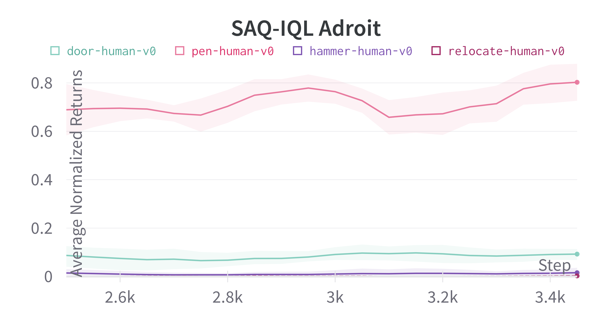

# SAQ: Action-Quantized Offline Reinforcement Learning for Robotic Skill Learning
A simple and modular implementation of the SAQ algorithm in Jax and Flax.


## Installation

1. Install and use the included Ananconda environment
```
$ conda env create -f environment.yml
$ source activate saq
```
You'll need to [get your own MuJoCo key](https://www.roboti.us/license.html) if you want to use MuJoCo.

2. Add this repo directory to your `PYTHONPATH` environment variable.
```
export PYTHONPATH="$PYTHONPATH:$(pwd)"
```

## Run Experiments
You can run SAQ-CQL experiments using the following command:
```
python -m vqn.vqn_main \
    --env 'HalfCheetah-v2' \
    --logging.output_dir './experiment_output'
```
All available command options can be seen in vqn/vqn_main.py and vqn/vqn.py.


You can run SAQ-BC experiments using the following command:
```
python -m vqn.vqn_main \
    --env 'HalfCheetah-v2' \
    --bc_epochs=1000 \
    --logging.output_dir './experiment_output'
```
All available command options can be seen in vqn/vqn_main.py and vqn/vqn.py.


You can run SAQ-IQL experiments using the following command:
```
python -m vqn.vqiql_main \
    --env 'HalfCheetah-v2' \
    --logging.output_dir './experiment_output'
```
All available command options can be seen in vqn/vqiql_main.py and vqn/vqiql.py.


For full working examples, you can run a sweep of SAQ-CQL, SAQ-IQL, and SAQ-BC on D4RL gym using the following command:
```
bash scripts/vqcql_gym.sh
bash scripts/vqiql_gym.sh
bash scripts/vqbc_gym.sh
```


This repository supports both environments in D4RL(https://arxiv.org/abs/2004.07219) and Robomimic(https://arxiv.org/abs/2108.03298).


To install Robomimic and download the Robomimic datasets, visit https://robomimic.github.io/docs/datasets/robomimic_v0.1.html#downloading.


## Weights and Biases Online Visualization Integration
This codebase logs experiment results to [W&B online visualization platform](https://wandb.ai/site). To log to W&B, you first need to set your W&B API key environment variable:
```
export WANDB_API_KEY='YOUR W&B API KEY HERE'
```
Then you can run experiments with W&B logging turned on:
```
python -m vqn.conservative_sac_main \
    --env 'halfcheetah-medium-v0' \
    --logging.output_dir './experiment_output' \
    --logging.online
```

## Example Runs





## Credits
The implementation of SAQ-CQL builds on [CQL](https://github.com/young-geng/JaxCQL)
The implementation of SAQ-IQL builds on [IQL](https://github.com/ikostrikov/implicit_q_learning)
